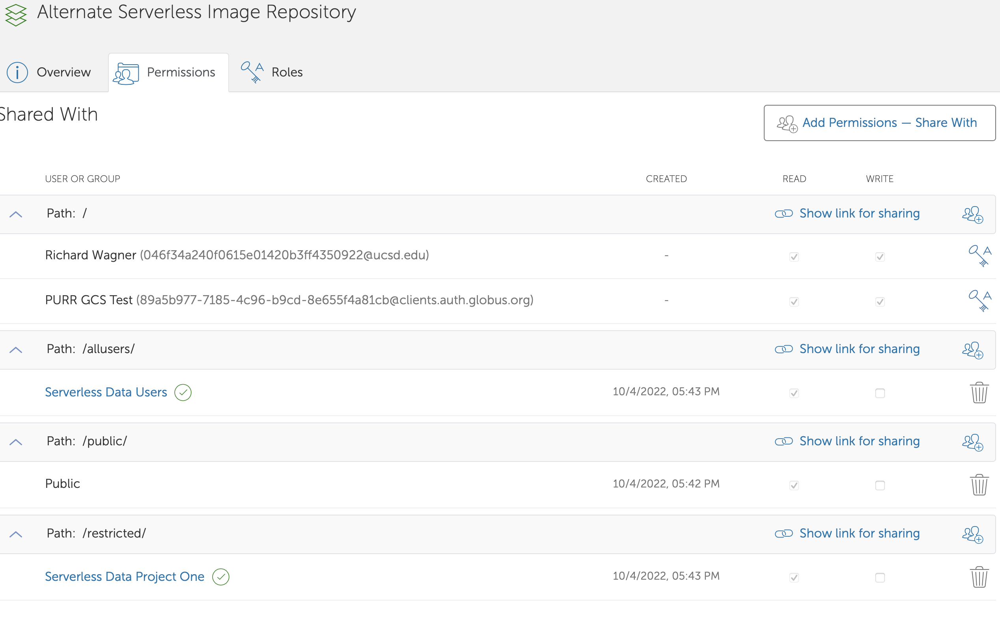

# GCS Setup


## EC2 Instance

```
AMI
us-west-2	jammy	22.04	amd64	hvm:ebs-ssd	20220901 ami-0c033eb565588ae0e	hvm
```


## Install GCS & Create Endpoint

Get a client ID and secret from [developers.globus.org](https://developers.globus.org)

Add repo
```
curl -LOs https://downloads.globus.org/globus-connect-server/stable/installers/repo/deb/globus-repo_latest_all.deb
sudo dpkg -i globus-repo_latest_all.deb
sudo apt-key add /usr/share/globus-repo/RPM-GPG-KEY-Globus
sudo apt update
sudo apt install globus-connect-server54
```

Endpoint setup

```
globus-connect-server endpoint setup "UCSD Research IT GCS Test" \
    --organization "UCSD Research IT" \
    --client-id "89a5b977-7185-4c96-b9cd-8e655f4a81cb" \
    --owner 046f34a240f0615e01420b3ff4350922@ucsd.edu \
    --contact-email rick@ucsd.edu

sudo globus-connect-server node setup \
    --client-id "89a5b977-7185-4c96-b9cd-8e655f4a81cb" \
	-i 44.225.185.144
```

Login to localhost. This can be done as a non-privileged account on the system. That's better, since it will store tokens in your home directory.
```
globus-connect-server login localhost
```

Set as managed. Needed to enable Guest Collections. Can continue on until this is done. Can also be done in the web app. Can be done by subscription managers.
```
globus-connect-server endpoint set-subscription-id 6cb69fd5-a845-11e7-aeab-22000a92523b
Message: Updated Endpoint 89a5b977-7185-4c96-b9cd-8e655f4a81cb
```

## Create a folder for the data

```
ubuntu@pgcs:~$ sudo mkdir /mnt/image-repository
ubuntu@pgcs:~$ sudo chown rpwagner:rpwagner /mnt/image-repository
```

## Storage gateway and mapped collection

path restrictions
```
ubuntu@pgcs:~$ cat image-repo-paths.json
{
  "DATA_TYPE": "path_restrictions#1.0.0",
  "none": [
    "/"
  ],
  "read_write": [
    "/mnt/image-repository"
  ]
}
```

External identity mapping
```
ubuntu@pgcs:~$ cat external-map.json 
{
  "DATA_TYPE": "external_identity_mapping#1.0.0",
  "command": [
    "/usr/bin/python3",
    "/opt/globus/mapapp-example.py"
  ]
}
```

Create POSIX storage gateway
```
globus-connect-server storage-gateway create posix \
   "Image Repo POSIX Gateway" \
    --domain ucsd.edu \
    --user-allow rpwagner \
    --identity-mapping file:external-map.json \
   --restrict-paths file:image-repo-paths.json
Storage Gateway ID: 1267bbc5-226e-4354-bdb8-2b5cc16437a6
```

Mapping file
```
ubuntu@pgcs:~$ cat gridmap-1267bbc5-226e-4354-bdb8-2b5cc16437a6
"046f34a240f0615e01420b3ff4350922@ucsd.edu" rpwagner
ubuntu@pgcs:~$ sudo cp gridmap-1267bbc5-226e-4354-bdb8-2b5cc16437a6 /etc/globus
```

Mapped collection
```
globus-connect-server collection create \
   1267bbc5-226e-4354-bdb8-2b5cc16437a6  \
   /mnt/image-repository \
   --private \
   --enable-https \
   --allow-guest-collections \
   "Image Repo Mapped Collection"
Collection ID: 4cc96c30-e1b5-451b-a5f0-8223acd0be14
```

## Test Collection

On GCS host
```
ubuntu@pgcs:~$ sudo -u rpwagner  touch /mnt/image-repository/data.txt
```

On laptop
```
$ globus session consent
'urn:globus:auth:scope:transfer.api.globus.org:all[*https://auth.globus.org/scopes/4cc96c30-e1b5-451b-a5f0-8223acd0be14/data_access]'

$ globus ls 4cc96c30-e1b5-451b-a5f0-8223acd0be14:
data.txt

```

## Create Guest Collection

Maps to `/mnt/image-repository/serverless`
```
Alternate Serverless Image Repository
https://app.globus.org/file-manager/collections/527fe9c0-5782-4a2a-a097-ea2f06fe68ab/overview
```

Set permissions

```
$ globus endpoint permission list 527fe9c0-5782-4a2a-a097-ea2f06fe68ab
Rule ID                              | Permissions | Shared With                                                        | Path        
------------------------------------ | ----------- | ------------------------------------------------------------------ | ------------
9eba1978-4446-11ed-89d4-ede5bae4f491 | r           | anonymous                                                          | /public/    
ada8f210-4446-11ed-89d4-ede5bae4f491 | r           | https://app.globus.org/groups/260da91f-3496-11ed-b941-972795fc9504 | /allusers/  
bbf8f6ee-4446-11ed-89d4-ede5bae4f491 | r           | https://app.globus.org/groups/cf9d1f5b-3496-11ed-b941-972795fc9504 | /restricted/
NULL                                 | rw          | 046f34a240f0615e01420b3ff4350922@ucsd.edu                          | /           
NULL                                 | rw          | 89a5b977-7185-4c96-b9cd-8e655f4a81cb@clients.auth.globus.org       | /           
(base) ITSC02C982DMD6M:~ rpwagner$ 
```



## Update paths to images

Previous
```
6528bad5-bc02-497d-8a4f-a38547d0e72a:/serverless/
https://g-b0978f.0ed28.75bc.data.globus.org/serverless/
```

Alternate
```
527fe9c0-5782-4a2a-a097-ea2f06fe68ab:/
https://g-079c7d.ca528.03c0.data.globus.org/
```
